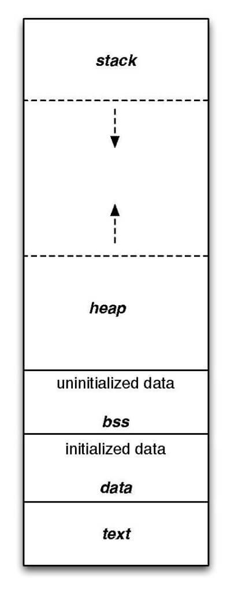

# Programmation Système - Processus

[Retour Licence 3](https://mcheungsen.github.io/cours/ "Licence 3")

[Retour Prog Sys](index.md)

---

# Processus

Instances de programmes

De multiples processus peuvent exécuter le même programme indépendamment.

## Espace d'adressage
Un processus est composé d'espace d'adressage divisé en régions de mémoire non contiguës.




Régions :
- Code
    - Instructions exécutables
    - Région en read only / execution
- Données
    - Allocation de variables statiques
    - segment de données initialisées
    - segment de données non initialisées
- Tas *heap*
    - Allocations dynamiques (malloc, free)
    - Géré par `libc` : expansion dynamique
- Pile *Stack*
    - Allocation des paramètres de fonctions et variables locales
    - Aggrandissement automtique avec une limite par défaut de 8 Mib sous Linux.
- Librairies partagées 
    - `libc, libm, libGl`

`Segmentation fault` : Accés à la mémoire vers une adresse invalide.

## Contexte d'exécution
En addition de l'espace d'adressage, le noyau stocke pour chaque processus :
- Process ID : see `getpid()`
- Priorité du process
- User ID (read, effective) : propriétaire du processus (peut en avoir 2)
- File Descriptor table
- Espace pour backup enregistrés

## Création de processus

```c
pid_t fork();
```

Clone l'appel du processus. Il y a 2 processus au lieu d'un.
L'espace d'adressage est dupliqué, et est indépendant.

Retours :
- Côté père : PID du fils
- Côté fils : 0

```c
pid_t wait(int * start_loc);
```

Attend que l'enfant termine son processus pour exécuter le processus suivant.

Version plus puissante :
```c
pid_t waitpid( pid_t pid, int * start_loc, int options);
```

## Transformation de processus

Un processus peut être reboot et executer un nouveau programme.

Famille de fonctions `exec` :
```c
int execlp( char * file, char * arg[], ..., NULL);
```
`l` : Liste arguments

`p` : path

```c
int execvp( const char * file, char * constargv[]);
```
`l` : vecteur d'arguments
`p` : path

## Communication entre les processus : Pipe `|`

`ls | grep pattern`

Le résultat de `ls` est redirigé vers `grep pattern`. On attend que `ls` soit terminé. Il n'y a donc pas de parrallélisme. Ordonné en FIFO *(First In First Out)*

```c
int pipe(int fildes[2]);
```
`fildes[0]` : reading
`fildes[1]` : writing

Pas de lseek

