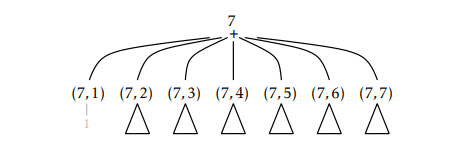
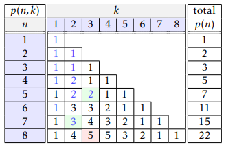

# Techniques Algorithmiques et Programmation

[Retour Cours](https://mcheungsen.github.io/cours/ "Licence 3")

[Retour Techniques algo prog](index.md)

# Partition d'un entier

## 1. Le problème

On s'intéresse à toutes les façons de partitionner un ensemble d'éléments indistinguables.

Par exempls, il a 5 façons de partager un ensemble de 4 billes :
4

3+1

2+2

2+1+1

1+1+1+1

||||||||||||||
|-|-|-|-|-|-|-|-|-|-|-|-|-|
|$$n$$|1|2|3|4|5|6|7|8|9|10|...|100|
|$$p(n)$$|1|2|3|5|7|11|15|22|30|42|...|190 569 292|`

**Partition d'un entier**
> **Instance** : Un entier n > 0.
> **Question** : Calculer $$p(n)$$, le nombre de partitions de $$n$$, soit le nombre de façons de partitionner un ensemble de $$n$$ éléments indistinguables en sous-ensembles non vides.

## 2. Formule asymptotique

Il n'y a pas de formule close pour la partition d'un entier. Il existe seulement des formules asymptotiques.

$$p(n) \sim \frac{1}{4n\sqrt{3}}.exp(\pi\sqrt{2n/3})\approx 13^{\sqrt{n}}\approx 2^{3.7\sqrt{n}}$$

## 3. Approche exhaustive

> Générer toutes les partitions puis de les compter.

Pour partitionner un ensemble de billes, on peut découper cet alignement en intervalles.

3+2+1+1

001011

0 : non séparation
1 : séparation

Cette approche reste **inefficace**. On va examiner $$2^{n-1}$$ découpages.

## 4. Récurrence

> **Diagramme de Ferrers :** représenter graphiquement une partition de n en utilisant un tableau. A partir du coin inférieur guche, n petits carrés en colonne de hauteur décroissante.


Chaque colonne représente une part de la partition.

Chaque partition est uniquement représentée par un diagramme (lié au fait que les colonnes sont triées par hauteur). Inversement, chaque diagramme comportant n carrés organisés en colonnes décroissantes représente une seule partition de n.

Les diagrammes se décomposent en éléments plus petits, facilitant leur comptage.

Par exemple si l'on coup un diagramme de Ferrers entre deux colonnes, on obtient deux diagrammes de Ferrers. De même si on le coupe entre deux lignes.

Le nombre de partitions de $$n$$ en $$k$$ parts.

$$p(n) = p(n,1) + ... + p(n,n) = \sum^n_{k=1}p(n,k)$$

*Parmi les 5 partitions de n = 4, on a déjà vu qu'il n'y en a exactement deux avec deux parts :
- 4 = 2 + 2
- 4 = 3 + 1

On peut vérifier qu'il y a 13 diagrammes de Ferrers avec 12 carrés et 5 colonnes, d'où p(12, 5) = 13.*

On peut classifier les partition de $$n$$ en $$k$$ parts, qu'on nommera **"diagrammes (n,k)"**, en deux types :
- la plus petite part est 1 (diagramme a)
- la plus petite part est au moins 2 (diagramme b)

$$p(n,k)=p_1(n,k) + p_2(n,k)$$

Supposons par récurrence qu'on a réussi à construire tous les diagrammes plus petit que (n,k). *L'un des deux paramètres est strictement plus petit.*

On obtient alors un diagramme (n-1, k-1) avec un carré et une colonne de moins.

Par conséquent, si à un diagramme quelconque (n-1, k-1) on ajoute une colonne de hauteur 1, on obtient un diagramme (n,k) de type 1. Il y a donc autant de diagramme (n,k) que (n-1, k-1)

$$p_1(n,k)=p(n-1,k-1)$$

On peut construire les diagrammes de type 2 à l'aide de diagrammes plus petits en les coupant au dessus de la première ligne.

$$p_2(n,k) = p(n-k,k)$$

On peut donc montrer la relation de récurrence :
$$p(n,k) = p(n-1, k-1)+p(n-k,k)$$

Pour que cette formule soir valable :
- à cause du premier terme :$$n-1 \geq k-1 \geq 1$$
- à cause du second terme :$$n-k \geq k \geq 1$$

Si $$k=1$$, $$p(n,k) = 1$$.

Si $$n<2k$$, $$p(n,k)=p(n-1,k-1)$$ car il n'y a pas de diagramme de type 2.

$$\left\{
\begin{array}{rcr}
1 \\
p(n-1, k-1) \\
p(n-1,k-1)+(p(n-k,k))
\end{array}
\right.$$

```C
long p(int n,int k){ // on suppose n > k > 1
if(k==1) return 1;
if(n<2*k) return p(n-1,k-1);
return p(n-1,k-1) + p(n-k,k);
}
long p_rec(int n){
long s=0;
for(int k=1;k<=n;k++) s += p(n,k); // calcule la somme
return s;
}
```

Pour analyser les peformances de la fonction `p_rec()` on utilise l'arbre des appels

> **arbre des appels** : Outil permettant de représenter l'exécution d'une fonction. Très pratique pour calculer sa complexité, notamment lorsque la fonction est récurive. Permet de repérer les calculs inutiles et d'améliorer éventuellement l'algorithme.

*L'arbre des appels d'une fonction est un arbre enraciné dont les noeuds représentent les paramètres d'appels et les fils les différents appels (éventuellement récursifs et/ou composés) lancés par la fonction. L'exécution de la fonction correspond à un parcours en profondeur de l'arbre depuis sa racine qui représente les paramètres du premier appel.*




**Complexité en temps**

La complexité est proportionnelle aux nombres de noeuds dans l'arbre des appels. Lors de l'exécution, le programme passe un temps constant par noeud. Ce nombre d'appels vaut 1 (racine) plus la somme des noeuds des arbres d'appels pour $$p(n,1),p(n,2),...,p(n,n)$$.

Trois types de noeuds :
- 2 fils
- 1 fils
- pas de fils

$$2p(n)-1+(2p(n)-1).(n-2) \lt 2n.p(n) = 2^{\Theta(\sqrt{n})}$$

## 5. Programmation dynamique

> **Programmation dynamique :** implémentation améliorée de la version récursive d'un algorithme. Au lieu de faire des appels récursifs, on utilise la **mémorisation** qui économise ainsi des calcul au détriment de l'espace mémoire.

La programmation dynamique consiste donc à trouver un algorithme sur une récurrence puis de l'implémenter en utilisant la technique de mémorisation pour supprimer les calculs inutiles.



```c
long p_prog_dyn(int n){
long P[n+1][n+1],s=0; // indices 0,1,...,n
int i,k;
for(i=1;i<=n;i++){ // pour chaque ligne i
    P[i][1]=1; // cas 1
    for(k=2;k<=i;k++) P[i][k] = P[i-1][k-1]; // cas 2 & début cas 3
    for(k=2;k<=i/2;k++) P[i][k] += P[i-k][k]; // fin cas 3
}
for(k=1;k<=n;k++) s += P[n][k]; // calcule la somme
return s;
}
```

## 6. Mémorisation paresseuse

Dans une fonction récursive, on peut toujours éviter les calculs redondant avec de la **mémoire supplémentaire**. (**Programmation dynamique**)

> On stocke au fur et à mesure le résultat de chaque appel (ainsi que l'appel lui-même) sans se soucier de l'ordre dans lequel ils se produisent. Si un appel avec les mêmes paramètres apparait, alors on extrait sa valeur de la table sans refaire de calculs.

L'idée est donc de modifier le moins possible la fonction d"origine en utilisant une mémorisation avec le moins d'efforts possibles.

**Exemple : Fibonacci**

> 0 1 1 2 3 5 8 13 21 34

```C
long fibo(int n){ // version d’origine
    if(n<2) return n; // fibo(0)=0, fibo(1)=1
    return fibo(n-1)+fibo(n-2);
}

long fibo_mem(int n){ // version mémoïsée
    static long F[]={[0 ... 99]=-1}; // initialisation en gcc
    if(n<2) return n;
    if(F[n]<0) F[n]=fibo_mem(n-1)+fibo_mem(n-2); // déjà calculée?
    return F[n];
}
```

## 7. Morale

> La récursivité à l’aide de formules de récurrence permettent d’obtenir des programmes concis, rapide à développer et dont la validité est facile à vérifier.

> La complexité peut être catastrophique si l’arbre des appels contient des parties communes. On passe alors son temps à recalculer des parties portant sur les
mêmes paramètres (c’est-à-dire les mêmes appels). C’est le cas lorsque la taille de
l’arbre (son nombre total de nœuds) est beaucoup plus grand que le nombre d’appels différents (le nombre de nœuds qui sont différents). Pour le calcul du nombre
de partitions de $$n$$, il y a $$2^{Θ(
√
n)}$$ nœuds dans l’arbre, alors qu’il y a seulement $$n²$$ appels différents possibles. Pour la récurrence de Fibonacci, il y a $$2^{Θ(n)}$$ nœuds dans
l’arbre pour seulement $$n$$ appels différents.

> La mémorisation permet d’éviter le calcul redondant des sous-arbres communs.
Plus généralement, la programmation dynamique utilise des récurrences à travers
une table globale indexée par les divers paramètres des appels.

> La programmation dynamique permet alors d’économiser du temps par rapport à
l’approche récursive naïve. L’inconvénient est l’usage de mémoire supplémentaire
(tables) qui, en cas de pénurie, peut être problématique. Car concrètement, en
cas de pénurie, il faut soit repenser l’algorithme soit modifier la machine en lui
ajoutant de la mémoire. Le manque de temps est peut être plus simple à gérer en
pratique puisqu’il suffit d’attendre.

> Une difficulté dans la programmation dynamique, outre l’établissement des récurrences qui peut être complexe, est qu’il faut souvent réfléchir un peu plus, par
rapport à la version récursive, quant au parcours de la table pour être certain de
remplir une case en fonction des cases déjà remplies. On peut y remédier grâce à la mémorisation
paresseuse, qui combine l’approche récursive et la mémorisation : on fait le calcul
et les appels récursifs seulement si l’appel n’est pas déjà en mémoire.


_____


[1 - Introdution](algo-prog-1.md)

--

[3 - Voyageur de commerce](algo-prog-3.md)


<script src="https://cdnjs.cloudflare.com/ajax/libs/viz.js/2.1.2/full.render.js"></script>
<script>var viz = new Viz();</script>


<script src="https://polyfill.io/v3/polyfill.min.js?features=es6"></script>
<script id="MathJax-script" async src="https://cdn.jsdelivr.net/npm/mathjax@3/es5/tex-mml-chtml.js"></script>