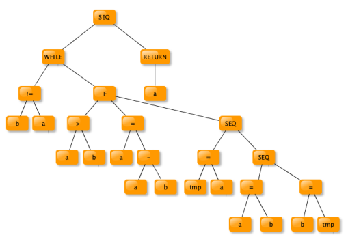

<<<<<<< HEAD
# [Compilation](index.md)

[Accueil](/index.html)

____
# Introduction

>**compilateur** : Logiciel de traduction d'un document depuis un langage **source** vers un langage **cible**.

*Langage source* : langage de programmation évolué (java, C, c++,...).

*Langage cible* : Code machine prévu pour programmer un ordinateur en particulier.

Un compilateur contient plusieurs modules :
- Analyseur lexical
- analiseur syntaxique
- analyseur sémantique
=======
# Compilation


[Retour Cours](https://mcheungsen.github.io/cours/ "Licence 3")

[Retour Compilation](index.md)

# Introduction

> **Compilateur** : logiciel de traduction d'un document depuis un langage **source** vers un langage **cible**.

Programme évolué (Java, C, C++, ...) permettant à un développeur d'implémenter un programme en utilisant des notions abstraites.

Le langage cible est un code machine prévu pour programmer un ordinateur.

Compilateur contient plusieurs modules : 
- Analyseur lexical
- Analyseur syntaxique
- Analyseur sémantique
>>>>>>> 2576e86ebd7484351017d6b75e10fdc580b98b38
- Générateur de code intermédiaire
- Optimiseur de code
- Générateur de code

<<<<<<< HEAD
Il gère une ou plusieurs tables de symboles qui donnent au développeur la possibilité de déclarer des variables, des fonctions, des procédures, des types,... .

Détecte et signale un ensemble d'erreurs à chaque niveau d'analyse *(Variable non déclarée, incompatibilité de type, utilisation d'une procédure avec de mauvais paramètres, ...)*.

> Le compilateur fait partie d'un ensemble d'outils permettant l'implémentation de logiciels.

*Éditeurs, Préprocesseur, Assembleur, Lieur, Chargeur*
=======
Gère une ou plusieurs tables de symboles qui donnent au développeur la possibilité de déclarer des variables, des fonctions, des procédures, les types, ...

Détecte et signale un ensemble d'erreurs à chaque niveau d'analyse (*Utilisation d'une variable non déclarée, incompatibilié de type, utilisation d'une procédure avec de mauvais paramètres, ...*).

Produit le code final, en corrigeant les erreurs.

Le compilateur fait partie d'un ensemble d'outils permettant l'implémentation de logiciels.
>>>>>>> 2576e86ebd7484351017d6b75e10fdc580b98b38

Préprocesseur $$\rightarrow$$ Compilateur $$\rightarrow$$ Assembleur $$\rightarrow$$ Lieur $$\rightarrow$$ Chargeur

Les phases et le résultat peuvent être différents d'un compilateur à un autre :
<<<<<<< HEAD
- Interprétation immédiate : Postcript, Shell, HTML
- Production de code portable (bytecode) pour une machine virtuelle (`P-Code`, `Class Java`), code dédié à une autre machine en particulier (`Postcript`, code machine pour tel processeur)
- Langages sources plus ou moins structurés
- Optimisation du code plus ou moins poussée
- Analyse et correction éventuelle des erreurs plus ou moins poussée

## Exemple
```C
int pgcd ( int a , int b ) {
while ( b != a ) {
if ( a > b )
a = a − b ;
else {
/∗ Echanger a e t b ∗/
int tmp ;
tmp = a ;
a = b ;
b = tmp ;
}
return a ;
}
```

**Analyse lexicale :**
`KEYWORD(int) IDENTIF(pgcd) LPAR KEYWORD(int) IDENTIF(a) COMMA KEY-WORD(int) IDENTIF(b) RPAR LCURVE KEYWORD(while) LPAR IDENTIF(b) DIFF
=======
- Interpretation immédiate plutôt que compilation proprement dite : `Postscript`, `Shell`, `HTML`
- Production de code portable (*bytecode*) pour une machine virtuelle (`P-Code`, `Class Java`),code dédié à une machine en particulier (`Postscript`, code machine pour tel processeur)
- Langages sources plus ou moins structurés (Assembleur peu structuré vs Java structuré)
- Optimisation du code plus ou moins poussée
- Analyse et correction éventuelle des erreurs plus ou moins poussée.

*Exemple*

```C
int pgcd ( int a , int b ) {
    while ( b != a ) {
        if ( a > b )
            a = a − b ;
        else {
        /∗ Echanger a e t b ∗/
        int tmp ;
        tmp = a ;
        a = b ;
        b = tmp ;
        }
    return a ;
    }
}

```

1. Analyse lexicale :

`KEYWORD(int) IDENTIF(pgcd) LPAR KEYWORD(int) IDENTIF(a) COMMA KEYWORD(int) IDENTIF(b) RPAR LCURVE KEYWORD(while) LPAR IDENTIF(b) DIFF
>>>>>>> 2576e86ebd7484351017d6b75e10fdc580b98b38
IDENTIF(a) RPAR LCURVE KEYWORD(if) LPAR IDENTIF(a) GT IDENTIF(b) RPAR
IDENTIF(a) AFF IDENTIF(a) MINUS IDENTIF(b) SEMI KEYWORD(else) LCURVE
COMMENT KEYWORD(int) IDENTIF(tmp) SEMI IDENTIF(tmp) AFF IDENTIF(a)
SEMI IDENTIF(a) AFF IDENTIF(b) SEMI IDENTIF(b) AFF IDENTIF(tmp) SEMI
RCURVE KEYWORD(return) IDENTIF(a) SEMI RCURVE`

<<<<<<< HEAD
**Analyse syntaxique** : Le code est transformé en une représentation arborescente.

```dot
Graph LR
    A --> B;
```
____

[Cours Suivant - Analyse lexicale](compilation-2.md)

=======
2. Analyse syntaxique :

La code est transformé en une représentation arborescente.



3. Analyse des types :

Chaque variable et la fonction sont associés aux types suivants :

**pgcd** : `int` x `int` $$\rightarrow$$ `int`

**a** : `int`

**b** : `int`

**tmp** : `int`

4. Production du code assembleur

```Assembly
WHILE1:
SET R1 DIFF a b
JUMP−IF R1 WHILE3
JUMP WHILE4
WHILE3:
JUMP−IF GT a b IF1
JUMP IF2
IF1 :
MINUS R2 A B
SET A R2
JUMP IF3
IF2 :
SET TMP A
SET A B
SET B TMP
IF3 :
JUMP WHILE1:
WHILE4:
RETURN A
```
____

[2 - Analyse lexicale (*tokenization*)](compilation-2.md)
>>>>>>> 2576e86ebd7484351017d6b75e10fdc580b98b38

<script src="https://polyfill.io/v3/polyfill.min.js?features=es6"></script>
<script id="MathJax-script" async src="https://cdn.jsdelivr.net/npm/mathjax@3/es5/tex-mml-chtml.js"></script>