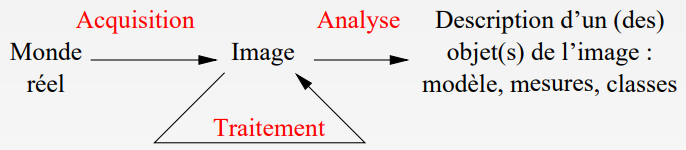
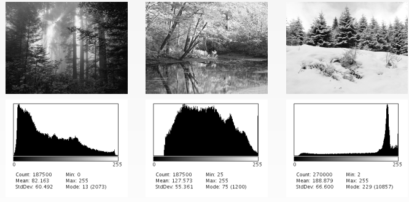
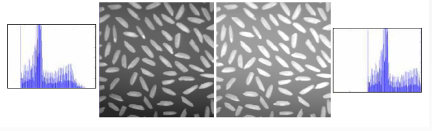
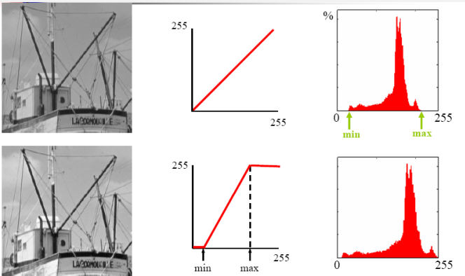
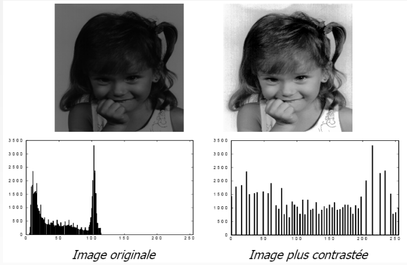
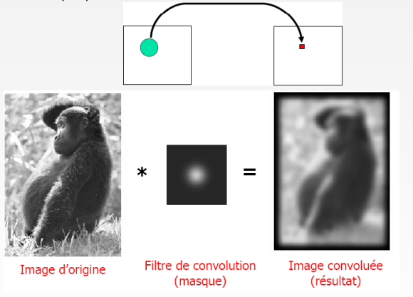
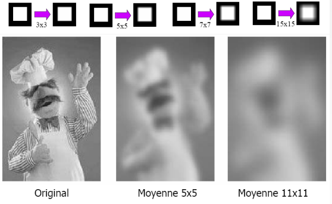
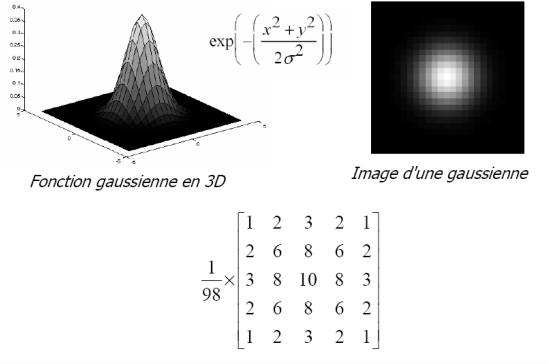
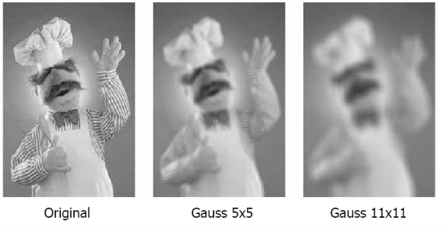
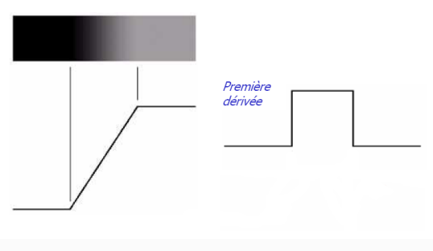

# Projet de développement logiciel

[Retour Cours](https://mcheungsen.github.io/cours/ "Licence 3")

[Retour Projet Dev](index.md)

______
# Traitement d'images

## Traitement / Analyse d'image


**Traitement** (bas niveau) : Suppression du bruit, augmentation de contraste, lissage, réhaussement des contours

**Analyse** (haut niveau) : Extraction d'informations

## Traitement d'images dans le projet

Structures de données et algorithmes spécifiques

Utilisation de la bibliothèque de manipulation d'images `Boofcv`

http://boofcv.org

> sous-problème : Temps de calcul complexité des des algorithmes, parallélisation

applications de retouche d'images existantes : gimp, Pixlr, Polarr PhotoEditor

> Numérisation = échantillonnage (nombre fini de points) + quantification (nombre fini de nuances)

## Image numérique
**Image numérique :** Matrice de pixels (largeur w, hauteur h)

**pixel :**
- Coordonnées dans l'image
- Valeur (notation I) niveau de gris ou couleur

## Codage de valeurs des pixels

### En niveau de gris

- La valeur d'un pixel est son intensité lumineuse
- binaire : 0 noir / 1 blanc
- Codage 8 bits : 0,...,255 (du plus foncé au plus clair)

### En couleur
- Codage dans l'espace RGB : trois intensités lumineuses rouge, vert, bleu.
- Codage 24 bits :

R = 0,...,255

G = 0,...,255

B = 0,...,255

> Transparence canal alpha

## Image en niveau de gris dans Boofcv

classe `GrayU8`

> Image with a pixel type of unsigned 8-bit integer

```java
// accesseurs
int get(int x, int y);
void set(int x, int y, int value);

// dimension
int width;
int height;
```

Il existe d'autres classes utiles : `GrayImageOps`, `GThresholdOmageOps`, `EnhanceImageOps`, etc.

## Histogramme
A chaque valeur on associe le nombre de pixels de l'image ayant cette valeur



## Luminance ou brillance d'une image

**Luminance ou brillance** : Moyenne de tous les pixels de l'image

> Pour augmenter la **luminance**, on peut ajouter une valeur constante à tous les pixels. L'histogramme est alors décalé.



## Constraste

Variance des niveaux de gris

$$\frac{1}{N} \sum \limits_{n=1}^N(I_n - Moy)²$$

$$I_n$$ 
valeur du nième pixel

$$N$$
nombre de pixels de l'image

## Améliorer le contraste

### Extension linéaire de dynamique
> On étire la dynamique en rééchelonnant les niveaux de gris entre 0 et 255.

$$I'=\frac{255}{max-min}(I - min)$$



```
// Initialisation de la LUT
Pour tout niveau de gris ng entre 0 et 255
    LUT[ng] = ( 255* (ng - min) / (max - min)
//Calcul de la transformation
Pour chaque pixel
    I' = LUT[I]

```

> **Limite** : Si la dynamique est déjà maximale, la transformation n'apporte aucun changement

### Égalisation de l'histogramme



1. Calcul de l'histogramme h(k) avec $$k \in [0,255]$$
2. Histogramme cumulé $$C(k) = \sum \limits_{i=1}^N(h(i))$$
3. Transformation des niveaux de gris de l'image $$I'= \frac{C(I)*255}{N}$$ $$N$$ est le nombre total de pixels de l'image

## Convolution
> **Convolution** : Transformation locale : Utilsiation du voisinage de chaque pixel



### Familles de filtres
> **Filtre passe-bas** : atténue le bruit et les détails

> **Filtre passe-haut** : accentue les détails et les contours

### Convolution : Calcul

filtre de convolution K (ou masque ou noyau) : Matrice $$(2n+1)\times (2n+1)$$

n : "rayon" du filtre

Calcul pour un pixel (x,y) : Somme des produits : **filtre linéaire**

$$R(x,y) = \sum \limits_{u=-n}^{u=n} \sum \limits_{v=-n}^{v=n} I(x+u, y+v).K(u+n,v+n)$$

Algorithme : On parcourt les pixels dans le voisinage du pixel(x,y)
```
r = 0
Pour u variant de -n à n
    Pour v varient de -n à n
    r = r + I(x+u, y+v) * K(u+n, v+n)
```

### Calcul sur les bords de l'image
- Mettre à zero
- Convolution partielle utilisant une portion du filtre
- Compléter les valeurs manquantes par exemple en construisant le miroir de l'image

`Enume BorderYpe`

`EXTENDED` : On reproduit à l'extérieur de l'image les valeurs du bord le plus proche

`NORMALIZED` : On utilise la partie du masque qui se trouve à l'intérieur de l'image

`REFLECT` : On déduit l'extérieur de l'image par symétrie autour du bord le plus proche

`SKIP` : Les pixels pour lequel on ne dispose pas du voisinage complet ne sont pas modifiés

`WRAP` : On suppose que l'image se répète périodiquement de gauche à droite, de haut en bas

`ZERO` : On suppose que l'extérieur de l'image est noir

## Filtre moyenneur

Filtre passe-bas
- Lisse l'image (effet de flou)
- Réduit le bruit
- Réduit les détails

Filtre dont tous les coefficients sont égaux (chaque pixel est remplacé par la moyenne de ses voisins)



## Filtre Gaussien
> Le filtre Gaussien donne un meilleur lissage et une meilleure réduction du bruit que le filtre moyenne.





## Contour

> **Contour** : Frontière entre deux objets dans une image. Discontinuité de l'image (variation brusque d'intensité)

Toute discontinuité n'est pas nécessairement situé à la frontière entre deux objets

Discontinuité :
- de profondeur
- d'orientation de surface
- de réflectance
- d'illumination

> **Principe de la détection de contour** : étude de la dérivée de la luminosité dans l'image, recherche des **valeurs élevées de dérivée**.



## Gradient : dérivée première de l'image

L'image est une fonction à deux paramètres $$(x,y)\rightarrow I(x,y)$$

Calculer la première dérivée de l'image (**vecteur gradient**) permet de trouver les contours dans l'image.

$$\overrightarrow{G}=(G_x,G_y) = (\frac{\delta I}{\delta x},\frac{\delta I}{\delta y})$$

### Calcul du gradient

On peut approximer les dérivées par "différences finies"

Calcul par convolution de l'image avec le masque [-1 0 1] : 

$$G_x(x,y) = I(x + 1, y) - I(x - 1, y$$

Calcul par convolution de l'image avec le masque

$$\begin{pmatrix}
-1\\
0\\
1
\end{pmatrix}$$

$$G_y(x,y) = I(x,y+1)-I(x,y-1)$$

## Détection de contour - Opérateurs

En pratique pour limiter les effets du bruit, on ajoute un petit lissage dans le calcul.

Opérateur de **Prewitt** : lissage = filtre moyenne
$$h1=\begin{pmatrix}
-1 & 0 & 1 \\
-1 & 0 & 1 \\
-1 & 0 & 1
\end{pmatrix} h2= \begin{pmatrix}
-1 & -1 & -1\\
0&0&0\\
1&1&1
\end{pmatrix}$$

Opérateur de $$Sobel$$ : lissage = filtre gaussien
$$h1=\begin{pmatrix}
-1&0&1\\
-2&0&2\\
-1&0&1
\end{pmatrix} h2 = \begin{pmatrix}
-1&-2&-1\\0&0&0\\1&2&1
\end{pmatrix}$$

>Il existe d'autres filtres plus sophistiqués donnant de meilleus résultats. *Filtre de Cany, filtre de Deriche, filtre de Shen-Castan*


______

[6](projet-dev-6.md) - 8

<script src="https://polyfill.io/v3/polyfill.min.js?features=es6"></script>
<script id="MathJax-script" async src="https://cdn.jsdelivr.net/npm/mathjax@3/es5/tex-mml-chtml.js"></script>